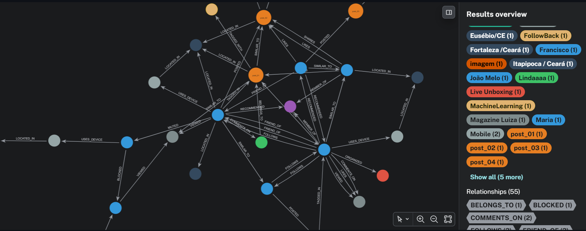

# 🌐 X4Good Social Media - Administrator Suite

O **X4Good Suite** é uma infraestrutura de gerenciamento e painel administrativo em tempo real para redes sociais baseadas em grafos. Desenvolvido com **Streamlit** e alimentado pelo **Neo4j Aura**, o ecossistema fornece uma interface visual altamente interativa para operações completas de CRUD (Criação, Leitura, Atualização e Deleção) sobre estruturas relacionais complexas, além de embutir motores nativos de Inteligência de Grafos para cálculo de similaridade e recomendação de conteúdo.

---

##  Demonstração em Produção

O painel de controle está implantado e pronto para uso através do link oficial:
 **[Acessar X4Good (Web App)](https://x4good.streamlit.app/)**

---

##  Visualização do Sistema

Para documentar a interface, adicione os prints das telas nos marcadores abaixo:

### 1. Painel de Autenticação e Visão Espacial do Grafo



---

##  Modelo de Dados (Schema do Grafo)

O ecossistema modela uma plataforma de mídia social completa através de:

- **11 Tipos de Nós (Rótulos):** `User`, `Post`, `Media`, `Comment`, `Community`, `Hashtag`, `Event`, `Device`, `Location`, `Advertisement`, `Topic`.
- **Arestas Principais:** `FOLLOWS`, `FRIEND_OF`, `LIKES`, `SHARES`, `COMMENTS_ON`, `POSTED`, `MEMBER_OF`, `TAGGED_IN`, `BLOCKED`, `MUTED`, `VIEWED`, `SIMILAR_TO`, `HAS_MEDIA`, `LOCATED_IN`.

---

##  Motores Algorítmicos Embutidos

O projeto possui scripts analíticos avançados para geração de inteligência sobre o grafo:

###  Motor de Similaridade (`SIMILAR_TO`)
Este motor calcula de forma cross-entidade o nível de afinidade entre elementos da rede, gerando novas arestas ponderadas por um `score_total` acumulado:
- **Usuários:** Avalia curtidas mútuas, comunidades compartilhadas, sobreposição de seguidores/seguidos e tópicos em comum.
- **Posts:** Avalia o compartilhamento de tópicos, concorrência de Hashtags e usuários engajados em comum.
- **Mídias, Comentários e Anúncios:** Mapeia comportamentos de bots (textos idênticos), afinidade de marcas e resoluções técnicas equivalentes.

###  Motor de Recomendação (`RECOMMENDED`)
Algoritmos de recomendação baseados em topologia estrutural:
- **Recomendação de Amigos:** Abordagem clássica de *Friend-of-a-Friend* (amigos em comum), recomendando usuários não conectados com validação de restrição de auto-vínculo.
- **Recomendação de Comunidades:** Identifica os clusters onde seus amigos mais engajam, mas que você ainda não faz parte.
- **Recomendação de Conteúdo (Posts, Eventos e Anúncios):** Filtros baseados em geolocalização residencial ou afinidade a tópicos específicos patrocinados por marcas.

---

##  Instalação e Execução Local

### 1. Clonar o Repositório
```bash
git clone https://github.com/adrikll/X4Good.git
```
### 2. Instalar dependências
```bash
pip install -r requirements.txt
```
### 3. Execução
```bash
streamlit run app.py
```