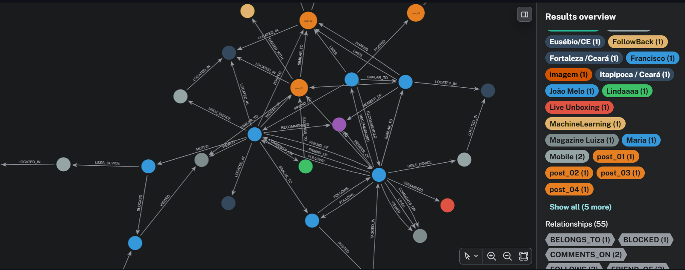
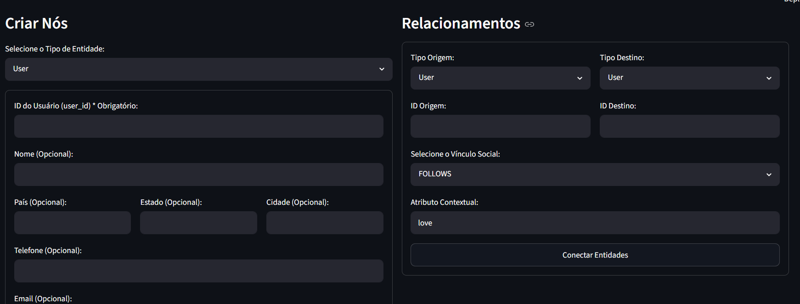
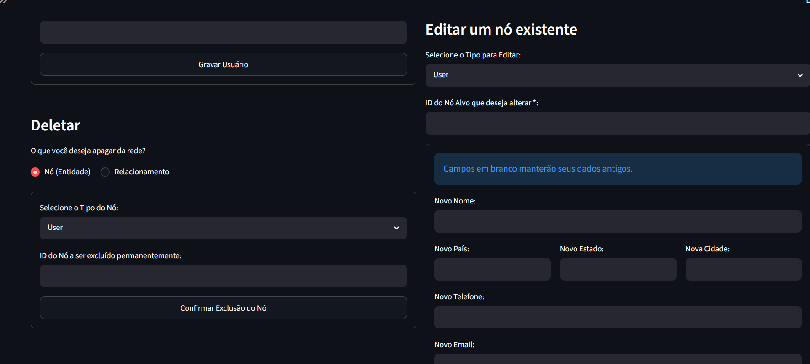
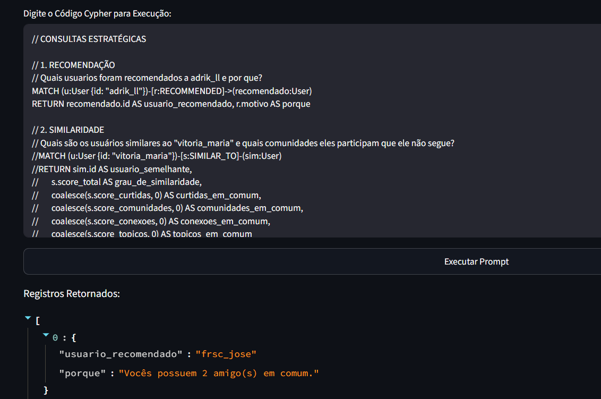

# X4Good Social Media - Administrator Suite

<p align="left">
  
  
  
  
  
  
  
</p>

O **X4Good Suite** é uma infraestrutura de gerenciamento e painel administrativo em tempo real para redes sociais baseadas em grafos. Desenvolvido com **Streamlit** e alimentado pelo **Neo4j Aura**, o ecossistema fornece uma interface visual interativa para operações completas de CRUD (Criação, Leitura, Atualização e Deleção) sobre estruturas relacionais complexas, além de embutir motores nativos de Inteligência de Grafos para cálculo de similaridade e recomendação de conteúdo.

---

##  Demonstração em Produção

Link oficial do painel de controle:
 **[x4good.streamlit.app](https://x4good.streamlit.app/)**

---

##  Visualização do Sistema

### Visão Espacial do Grafo



### Criação de Nós



### Deletar e editar



### Prompt Cypher



---


##  Modelo de Dados (Schema do Grafo)

O ecossistema modela uma plataforma de mídia social completa através de:

- **11 Tipos de Nós (Rótulos):** `User`, `Post`, `Media`, `Comment`, `Community`, `Hashtag`, `Event`, `Device`, `Location`, `Advertisement`, `Topic`.
- **Arestas Principais:** `FOLLOWS`, `FRIEND_OF`, `LIKES`, `SHARES`, `COMMENTS_ON`, `POSTED`, `MEMBER_OF`, `TAGGED_IN`, `BLOCKED`, `MUTED`, `VIEWED`, `SIMILAR_TO`, `HAS_MEDIA`, `LOCATED_IN`.

---

##  Implementações Inteligentes

O projeto possui scripts analíticos para geração de inteligência sobre o grafo:

###  Similaridade (`SIMILAR_TO`)
Calcula de forma cross-entidade o nível de afinidade entre elementos da rede, gerando novas arestas ponderadas por um `score_total` acumulado:
- **Usuários:** Avalia curtidas mútuas, comunidades compartilhadas, sobreposição de seguidores/seguidos e tópicos em comum.
- **Posts:** Avalia o compartilhamento de tópicos, concorrência de Hashtags e usuários engajados em comum.
- **Mídias, Comentários e Anúncios:** Mapeia comportamentos de bots (textos idênticos), afinidade de marcas e resoluções técnicas equivalentes.

###  Recomendação (`RECOMMENDED`)
Algoritmos de recomendação baseados em topologia estrutural:
- **Recomendação de Amigos:** Abordagem clássica de *Friend-of-a-Friend* (amigos em comum), recomendando usuários não conectados com validação de restrição de auto-vínculo.
- **Recomendação de Comunidades:** Identifica os clusters onde seus amigos mais engajam, mas que você ainda não faz parte.
- **Recomendação de Conteúdo (Posts, Eventos e Anúncios):** Filtros baseados em geolocalização residencial ou afinidade a tópicos específicos patrocinados por marcas.

---

##  Como fazer seu próprio Administrador Suíte

### 1. Configuração do Banco de Dados (Neo4j Aura)

Acesse o Neo4j AuraDB e crie uma nova instância.
Ao criar, baixe ou copie as credenciais fornecidas (URI, Username, Password, etc) e guarde-as.

### 2. Configuração do Ambiente Local
Na raiz do seu projeto, crie uma pasta oculta chamada .streamlit e dentro dela um arquivo chamado secrets.toml e coloque as credencias do banco:

```
# .streamlit/secrets.toml
NEO4J_URI = "uri"
NEO4J_USERNAME = "username"
NEO4J_PASSWORD = "password"
NEO4J_DATABASE = "database_id"
```
### 3. Instalação de Dependências
```
pip install -r requirements.txt
```

### 4. Executando o Projeto Localmente

```
streamlit run app.py
```
### 5. Deploy (Streamlit Community Cloud)
Suba o código atualizado do seu projeto para um repositório público ou privado no GitHub.

Acesse o Streamlit Community Cloud, crie um novo app e conecte-o ao seu repositório.

Adicione as credenciais do banco nas variáveis secretas do seu app:


```
# .streamlit/secrets.toml
NEO4J_URI = "uri"
NEO4J_USERNAME = "username"
NEO4J_PASSWORD = "password"
NEO4J_DATABASE = "database_id"
```

E pronto!

